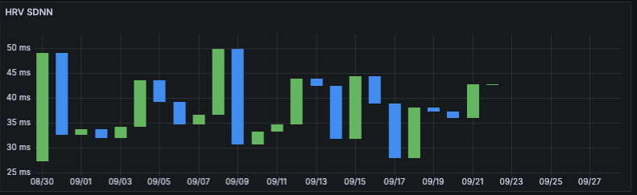
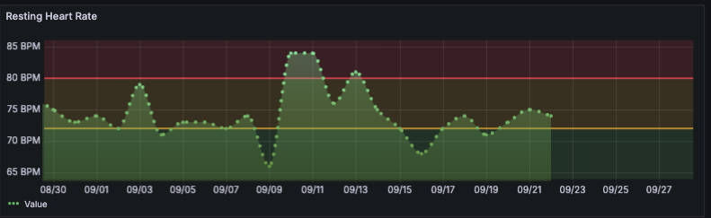
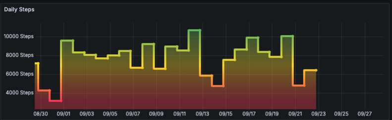
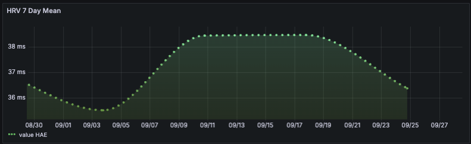

# BioSignal AI — Apple Health Analytics Demo

Open-source demo that ingests Apple Health (Health Auto Export) data, organizes it with Python, stores it in InfluxDB, and visualizes key metrics in Grafana.  
**Focus:** practical biosignal analytics + an AI roadmap that moves from descriptive dashboards to predictive, personalized insights.

---

## What’s in this repo
- **Notebooks & scripts** to normalize Apple Health JSON into tidy time series.
- **Exported charts** (HRV, Resting HR, Steps) you can view right here.
- **Docs** explaining the pipeline and the AI roadmap.

- ## Try the Notebook (no secrets required)

We include a small, **public-safe** demo in [`demo/health_demo.ipynb`](demo/health_demo.ipynb) that runs out of the box using a synthetic Apple-Health-like export [`demo/example_health_export.json`](demo/example_health_export.json).

**How to run it:**
1. Open the notebook in GitHub → “Open in Colab/nbviewer” or download and run locally in Jupyter.
2. It will load the bundled synthetic JSON and plot:
   - HRV (SDNN) in ms
   - Resting Heart Rate (bpm)
   - Daily Steps (count)
3. To use your own Health Auto Export JSON, change `INPUT_JSON` in the first cell to your file path (do **not** commit private data).

> Production infra (compose files, secrets, HA/Frigate, etc.) lives in a **private** repo. This public repo is safe to share—no secrets.

---

## Quick look (sample outputs)

  
  

  
  
  

---

## Pipeline (high level)

1. **Export** Apple Health using *Health Auto Export* (JSON).
2. **Normalize** with Python → tidy dataframe: `_time`, `_metric`, `value`, and tags (e.g., source, unit).
3. **Store** in InfluxDB (bucket: `health`).
4. **Visualize** in Grafana (Panels for HRV, Resting HR, Steps).
5. **Roadmap to AI** (see below) for anomaly detection, forecasting, and personal coaching.

> Detailed overview: [`docs/project_overview.md`](docs/project_overview.md)

---

## Why this matters
- **HRV** reflects autonomic balance, stress, and recovery readiness.
- **Resting HR** summarizes baseline cardiovascular load.
- **Steps & Distance** add context for training load and recovery.

Combining these with sleep and activity intensity enables **AI-assisted guidance**: readiness scores, recovery recommendations, and early warning for overtraining or illness.

---

## AI & ML Roadmap (short)
- **Phase 1 (descriptive):** metric QA, gaps, and trend enrichment (7-/30-day baselines).
- **Phase 2 (predictive):** 
  - Classical: ARIMA/Prophet/ETS baselines for HRV & RHR.
  - ML: Gradient boosting for next-day RHR/HRV + feature importances.
  - **Anomaly detection** (robust z-scores / STL residuals).
- **Phase 3 (prescriptive + LLM):**
  - Rule-enhanced recommendations (sleep, hydration, deload).
  - LLM-based narrative insights using structured facts from the timeseries.
- **Phase 4 (personalization):** user-specific priors and Bayesian updating.

Full details: [`docs/upwork_project.md`](docs/upwork_project.md)

---
## Repository layout
bio-health-data/
├─ assets/                     # screenshots used in the README
├─ demo/
│  ├─ health_demo.ipynb        # public-safe notebook (synthetic example)
│  └─ example_health_export.json
└─ docs/                     

## Run it yourself (summary)
- Export JSON from Health Auto Export.
- Use the provided notebook/script to tidy & write to InfluxDB.
- Connect Grafana → InfluxDB (URL, org, bucket, token).
- Import example panels and start iterating.

---
## Privacy & what’s private

This public repo only contains **safe demo materials** (no secrets, no personal exports).
Our production infrastructure (Docker, InfluxDB, Grafana, Home Assistant, Mosquitto configs, tokens/secrets) lives in a **private** repository.
## License
MIT
